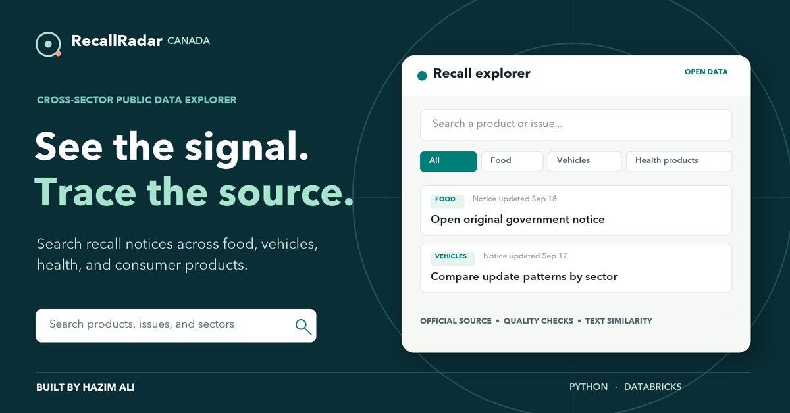

# RecallRadar Canada



A searchable, source-linked explorer of Canadian recall and safety-alert notices across food, vehicles, medical devices, health products, and consumer products.

**Live demo:** https://hazimali07.github.io/recallradar-canada/  
**Data:** [Government of Canada Recalls and Safety Alerts](https://open.canada.ca/data/en/dataset/d38de914-c94c-429b-8ab1-8776c31643e3)  
**Author:** Hazim Ali

## The question

How can someone quickly find relevant notices across different product sectors, see how notice topics change, and trace every result back to the government source?

The app supports product, issue, category, and organization search; sector and date filters; monthly update trends; issue-label comparisons; source-record inspection; and text-similar notices. It is a public-data research tool, **not a safety advisory or risk score**.

## What I built

| Layer | Work |
| --- | --- |
| Ingestion | Download the English JSON feed from the official recalls site with a unique request parameter to avoid a stale CDN response. |
| Quality | Validate official-source URLs and IDs, de-duplicate by notice ID, clean text, validate dates, and report exclusions. |
| Analysis | Map publisher units to broad sectors, count source *last-updated* notices, and compute TF-IDF cosine neighbours within each sector. |
| Interface | Dependency-free static app with search, filters, source inspection, trends, and responsive layout. |
| Refresh | Scheduled GitHub Actions workflow rebuilds the snapshot and runs data checks. |
| Databricks | Companion PySpark notebook reproduces the cleaning and sector/issue analysis. |

The September 23, 2026 snapshot checked **34,107** source records and included **5,852** dated notices from the approximate prior 36 months. **2,717** source records had no valid last-updated date and were excluded from the time-based explorer. Counts will change with source updates; the live explorer shows its own snapshot date.

## Run locally

Python 3.10+ is sufficient; no package install is required.

```bash
python3 pipeline/build_data.py --output docs/data.json
python3 -m unittest discover -s tests -v
python3 -m http.server 8765 --directory docs
```

Open http://localhost:8765/. To rebuild from a downloaded copy of the source, pass `--input path/to/HCRSAMOpenData.json`.

## Data definitions and limits

- **Notice:** One source row identified by `NID`. It is not one affected product, vehicle, case, injury, or sale.
- **Date:** `Last updated` from the source. An update can occur long after a notice first appears. The 7-day count means *updated in the past seven days*.
- **Snapshot:** Dated notices in an approximate 36-month lookback ending on the build date. The complete source includes older and undated records.
- **Archived:** The publisher's source flag, displayed as supplied. It does not mean a product is safe or a problem is resolved.
- **Recall class:** Source text is displayed without equating class systems across product sectors. Missing labels remain missing.
- **Related notices:** TF-IDF cosine similarity uses title, product, issue, and category text, within the mapped sector. These matches are for exploration only; they are not causal links, duplicate determinations, or safety assessments.
- **Sector:** A broad grouping derived from the source organization. The cross-sector Communications and Public Affairs Branch uses its category where that category clearly identifies one sector; mixed and unknown categories remain `Other`.
- **Databricks date:** The notebook defaults to the current UTC date. Set its `as_of_utc` widget to the site's snapshot date when comparing exact time windows.
- **Guidance:** The app points to each full official notice. It does not generate safety instructions.

The Government of Canada feed is updated daily, but a scheduled refresh is a repository workflow, not a guarantee that the source or deployed page has updated. The interface always displays its snapshot date.

## Source and licence

Contains information licensed under the [Open Government Licence – Canada](https://open.canada.ca/en/open-government-licence-canada). Source: Health Canada, [Recalls and Safety Alerts open dataset](https://open.canada.ca/data/en/dataset/d38de914-c94c-429b-8ab1-8776c31643e3), which aggregates notices from several government authorities. This independent portfolio project is not endorsed by the Government of Canada.

## Repository map

- `pipeline/build_data.py`: reproducible ingestion, normalization, date filtering, and similarity calculation
- `docs/`: GitHub Pages app and reviewed snapshot
- `notebooks/RecallRadar_Databricks.ipynb`: PySpark companion analysis
- `tests/`: pipeline and snapshot checks
- `.github/workflows/refresh.yml`: scheduled refresh
